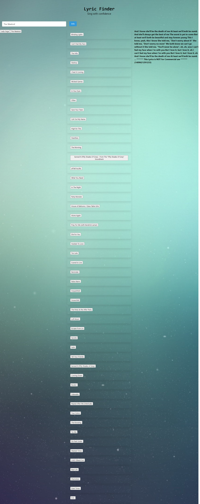

# Lyric-finder
Project #1
Created by: Chris Garica, Ashley Kohl Adler, Lyndsey Finamore and Jonathan Davidson

Welcome to our application!  
Lyrically challanged? We are here for you. As many of us can attest to, being able to understand and interpert lyrics accurately can be tough. As a team, we have created a music finder application that allows the user to search for an aritst + song on the top 50 list and then able to view the lyrics to the selected song. 

## API's
- We used Last FM and Musixmatch

### Link to delployed application
<a href="https://lyndseyfin.github.io/Lyric-finder/">Lyric Finder</a>

#### Screenshot
